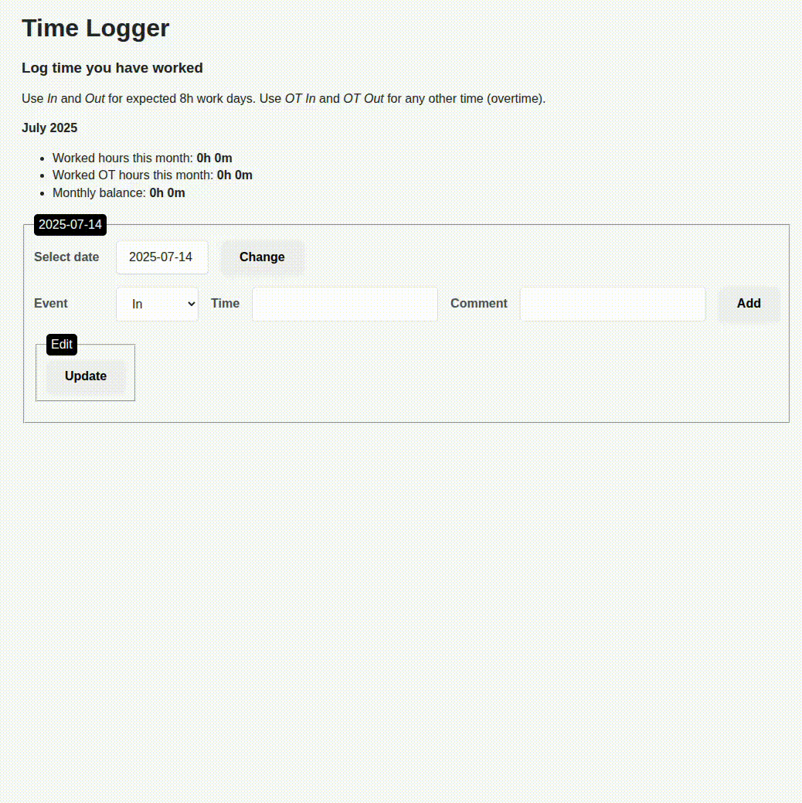

# time-logger

To keep track of your working hours

**Goals:**

- [x] Make it work: fastapi + jinja2
- [x] Containerize it to allow anyone to test it easily
- [x] Add data models
    - Not a very strict implementation, but tried to collect the data and its logic
- [x] Protect against SQL injection
    - sqlite3 lib parameters used

Extra things added after the above main functionality was implemented:
- [x] Add date picker
- [x] Makefile for convenience to locally build and run with Docker
- [x] Authentication
- [ ] Use HTTPException when capturing input error and redirecting
- [ ] Add 24h format time selector and/or validate input (using js before submitting)
- [ ] Add page with overview of previous months?
- [ ] Make the important time calc logic (unit) testable

## Deployment

Containerize it and run locally.

### Using make (recommended)

1. `sudo make`

You need to run make as sudo unless you are running docker engine in [rootless mode](https://docs.docker.com/engine/security/rootless/).

### Without make

1. `sudo docker build -t time-logger .`
2. `mkdir db`
3. Run one of the following:
    * `export CURRENT_UID=$(id -u):$(id -g) && sudo -E docker compose -f compose.yml up`
    * `sudo docker run --user $(id -u):$(id -g) --mount type=bind,src=./db,dst=/db -p 8000:8000 time-logger`

The user it set to the current user in order to allow it smoothly to be run locally. Change this to something else if you want to run it elsewhere, and remember to make sure to set the ownership on the db/ folder accordingly.

## Development

Using python-dotenv for setting env variables while developing: https://pypi.org/project/python-dotenv/

Pre-requisite: Create an account on auth0 (free tier available) and setup an app with a login to use.

1. Create `.env` and populate it with:
    ~~~shell
    # time-logger app
    DB_FILE="../db/time_logger.db"

    # auth0
    CLIENT_ID=
    CLIENT_SECRET=
    DOMAIN=
    SESSION_SECRET=
    ~~~
2. `source venv/bin/activate` (assumes you are in a linux environment)
3. `cd app/`
5. Run fastapi app: `fastapi dev main.py`

Verify newly added code passes flake8 tests:
1. `source venv/bin/activate`
2. `flake8 app/`

*Intentionally excluded a few things in flake8 to stay closer to the readability of other similar c-like languages.*

## Dependencies

* python-dotenv = variables (database table names in our case) set for development
* python-multipart = fastapi requires this to handle form data

## Study notes and lessons learned

### Lesson learned

This little exercise taught me that the data management quickly escalated in an unorganized way. It quickly became hard to keep the data structured in terms of *'view'* and database. It was not my intention to focus on this part but at the same time I understand this is probably a challenge every time building an app and that an ORM or at the very least some existing implementation of structured data models could be beneficial.

Next app I would like to try using one of the modern front-end frameworks (react maybe) to see if data handling becomes more structured and flexible in terms of logic compared to when using the older server-side template setup. I would also like to learn if it actually saves time just using an older styled template setup (for smaller apps) like this compared to using a modern front-end (assuming it's quicker when you have learned that approach).

### forms

From https://developer.mozilla.org/en-US/docs/Learn_web_development/Extensions/Forms/Sending_and_retrieving_form_data

Observe there is both GET and POST methods for forms.

Both absolut and relative urls can be used. Relative:
~~~html
<form action="/somewhere_else">…</form>`
~~~ 

From FastAPI docs:

    "The way HTML forms (<form></form>) sends the data to the server normally uses a "special" encoding for that data, it's different from JSON."

    "Data from forms is normally encoded using the "media type" application/x-www-form-urlencoded.
    But when the form includes files, it is encoded as multipart/form-data. You'll read about handling files in the next chapter."

From https://developer.mozilla.org/en-US/docs/Web/HTTP/Reference/Methods/POST

    "A form using application/x-www-form-urlencoded content encoding (the default) sends a request where the body contains the form data in key=value pairs, with each pair separated by an & symbol, as shown below:"

~~~
POST /test HTTP/1.1
Host: example.com
Content-Type: application/x-www-form-urlencoded
Content-Length: 27

field1=value1&field2=value2
~~~

`<input type="date">` was previously unknown to me. It seems to be a very convenient (and well supported) way instead of trying to conjure something using javascript: https://developer.mozilla.org/en-US/docs/Web/HTML/Reference/Elements/input/date

### fastapi

redirects: https://fastapi.tiangolo.com/it/advanced/custom-response/#ujsonresponse

We must use status code 303 instead of 307 after a POST when redirecting. Otherwise the browser will try to redirect using POST. With 303 it will redirect with GET instead.

https://developer.mozilla.org/en-US/docs/Web/HTTP/Reference/Status/303

    "This response code is often sent back as a result of PUT or POST methods so the client may retrieve a confirmation, or view a representation of a real-world object"

### auth0

Followed and implemented parts of this excellent guide: https://developer.auth0.com/resources/guides/web-app/fastapi/basic-authentication
